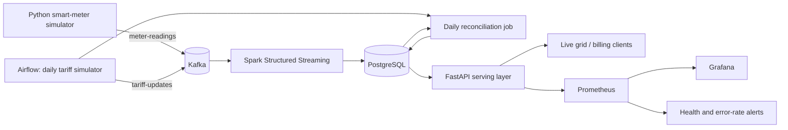

# Smart Grid Pulse — EC8203 Data Engineering Mini-Project

A complete Kappa-style data platform for real-time grid monitoring and daily household billing. It combines simulated smart-meter events with a once-per-simulated-day tariff feed, exposes live metrics through an API, and creates a consolidated CSV billing report.

## Architecture



The Kappa choice keeps Kafka as the replayable event log and avoids parallel batch/stream business logic. The daily CSV remains a genuine scheduled source; Airflow validates, publishes, loads, and reconciles it. Simulated time is compressed so **one day equals five minutes**.

## Quick start

Requirements: Docker Desktop/Engine with Compose v2, at least 6 GB free RAM, and ports 3000, 5432, 8000, 8080, 9090 and 29092 available.

```bash
cp .env.example .env
docker compose up --build -d
```

Wait about 90 seconds on the first start, then open:

- API docs: <http://localhost:8000/docs>
- Live metrics: <http://localhost:8000/api/v1/grid/live>
- Airflow: <http://localhost:8080> (credentials are printed by `docker compose logs airflow`)
- Prometheus: <http://localhost:9090>
- Grafana: <http://localhost:3000> (`admin` / `admin`)

In Airflow, enable `smart_grid_daily` and trigger it once. A new tariff CSV appears in `data/batch/`; the consolidated report appears in `data/reports/`. Airflow runs it every five minutes thereafter.

Verify the system:

```bash
python scripts/demo_check.py
docker compose ps
docker compose logs --tail=50 spark meter-producer airflow api
```

Stop without deleting PostgreSQL data with `docker compose down`. To remove the named database volume too, use `docker compose down -v` only when you intentionally want a clean reset.

## Data contracts and processing

`meter-readings` is keyed by `household_id` and contains a UUID event key, meter and household IDs, consumption, solar generation, zone and an ISO-8601 timestamp. Spark rejects null IDs and negative energy values, deduplicates by `event_id`, derives `net_grid_kwh=max(0, consumption-solar)`, and produces one-minute zone windows. A two-minute watermark bounds late-state retention.

`tariff-updates` is keyed by household and represents the daily CSV contents. The topic is suited to compaction in a production deployment. Airflow loads the current reference values with an idempotent PostgreSQL upsert, then calculates household consumption, solar contribution, net grid draw and estimated charge. The report upsert makes task retries safe.

## API

| Endpoint | Purpose |
|---|---|
| `GET /health` | Database-backed liveness check |
| `GET /api/v1/grid/live` | Latest one-minute load and renewable contribution by zone |
| `GET /api/v1/billing/{YYYY-MM-DD}` | Daily household bills, highest first |
| `GET /metrics` | Prometheus metrics |

Example: `curl http://localhost:8000/api/v1/grid/live`.

## Observability

All Python stages emit JSON logs with timestamp, severity, component and event context. Prometheus scrapes API request counts/latency and service reachability. Rules fire when the API is down for one minute or when its five-minute-equivalent error ratio exceeds 5%. Spark checkpoints and Kafka consumer offsets expose replay/recovery state; Airflow supplies per-task status, duration and retry history.

## Testing

Install the lightweight Python dependencies and run:

```bash
python -m pip install -r requirements.txt
python -m pytest -q
```

The tests verify source contracts, non-negative measurements, tariff coverage and the net-grid formula. End-to-end validation is `python scripts/demo_check.py` after the stack is healthy.

## Demo script (5–10 minutes)

1. Show this architecture and explain why Kappa avoids duplicate logic.
2. Run `docker compose ps`; follow JSON logs from `meter-producer` and `spark`.
3. Open `/api/v1/grid/live` and point out zone load, solar and renewable percentage.
4. Trigger `smart_grid_daily` in Airflow; show the task graph and generated CSV.
5. Open `/api/v1/billing/2026-09-28` using the active logical date.
6. Show Prometheus targets/rules and Grafana datasource; stop the API briefly only if a live alert demonstration is safe.
7. Explain checkpoint recovery, idempotent event IDs/upserts, limitations and production changes.

## Assumptions and limitations

- Twenty households are deterministic identities; readings are random and intentionally small.
- One simulated day is five minutes. Event-time windows are one minute with a two-minute watermark.
- Docker uses a single Kafka broker and a single Spark process for laptop reproducibility, not resilience.
- PostgreSQL is adequate for this demonstration volume. Production would partition time-series data, enforce TLS/secrets, add a schema registry and data-quality quarantine, and deploy Kafka/Spark/PostgreSQL redundantly.
- Billing is an estimate based on net imported energy; export credits, taxes and time-of-use intervals are outside scope.

## Two-person team contribution statement

Replace the placeholders before submission.

- **Madakaladeniya I.U — EG/2021/4651:** Kafka and meter simulator; Spark streaming transformations/checkpointing; unit tests; architecture and processing sections of report.
- **Wijesinghe S.A — EG/2021/4877:** Tariff simulator and Airflow DAG; PostgreSQL/API; Prometheus/Grafana; Docker Compose; results, observability and limitations sections.
- **Joint work:** architecture decision, integration testing, demo rehearsal, code review and final report editing. Each member should be ready to explain all core logic.

## Repository map

```text
airflow/dags/                 scheduled tariff + report pipeline
data/                         sample and generated reports
observability/                Prometheus alerts and Grafana datasource
report/                       assessed technical report source/PDF
scripts/                      demo smoke check
sql/                          serving schema
src/producers/                streaming and daily source simulators
src/processing/               Spark Structured Streaming job
src/batch/                    daily reconciliation logic
src/api/                      serving and metrics API
tests/                        automated source/logic tests
```

